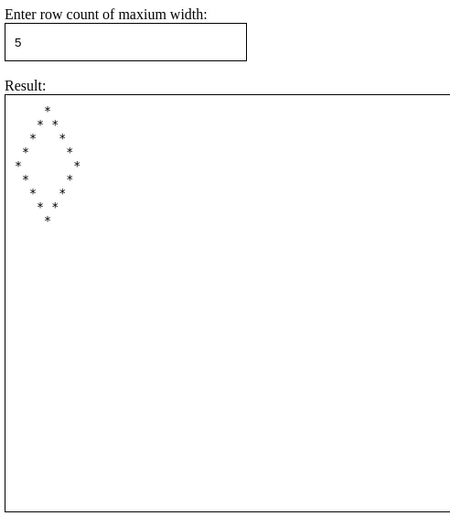

<p>Clarusway</p>

# JS-CC-022 : Draw Diamond with Star Character

The purpose of this coding challenge is to draw an empty diamond figure (only the outline) into textarea field, using star character (*). Take the number of rows from user and draw the diamond figure accordingly. Add event listener to the input field and call the function when the user enters or changes the value.

## Expected Outcome
```
    *
   * *
  *   *
 *     *
*       *
 *     *
  *   *
   * *
    *
```
​


## Learning Outcomes

At the end of the this coding challenge, students will be able to;

- Analyze a problem, identify and apply programming knowledge for appropriate solution.

- Demonstrate their knowledge of algorithmic design principles by using JavaScript effectively.

- Use the DOM to manipulate the page.

- Become familiar with the DOM Events API.

## Problem Statement

### Sample Input
Enter row count of maxium width: `5`


<center> ⌛ Happy Coding  ✍ </center>
