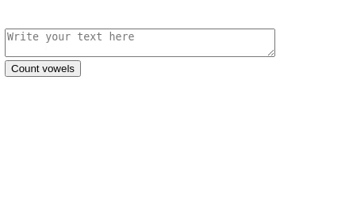

Clarusway

# JS-CC-005 : Vowels in a string

Create a function that'll return an integer of the number of vowels found in a string.

## Expected Outcome

## Learning Outcomes

At the end of the this coding challenge, students will be able to;

- Analyze a problem, identify and apply programming knowledge for appropriate solution.

- Demonstrate their knowledge of algorithmic design principles by using JavaScript effectively.

## Problem Statement

- Take a string from user.
- Calculate the number of vowels and present them on the page.

 ⌛ Happy Coding  ✍ 

